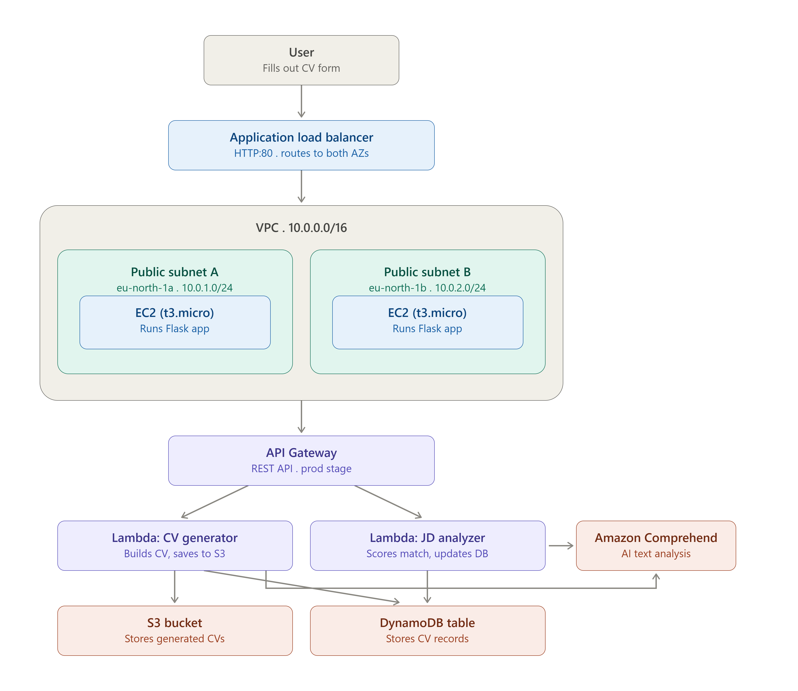
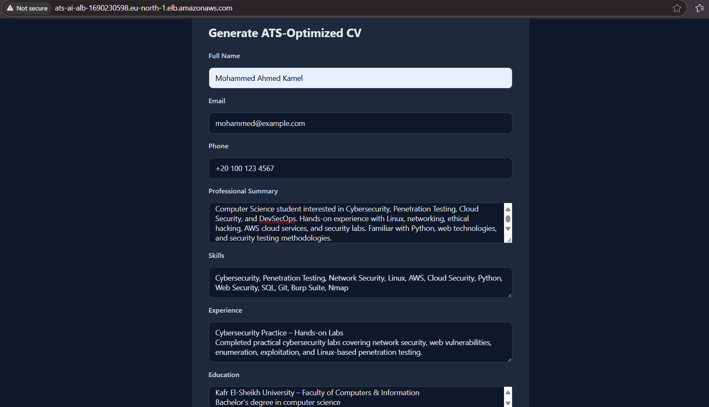
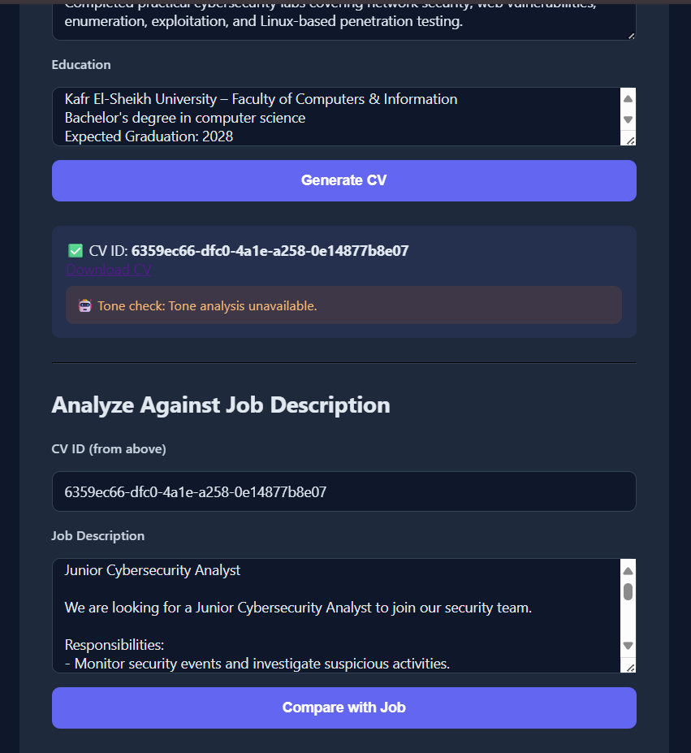

# 🎯 ATS CV Generator — AI-Enhanced (Amazon Comprehend)

> An evolution of the original serverless ATS CV Generator — same core architecture, now with Amazon Comprehend replacing naive regex matching with real language understanding.

## 📋 Table of Contents

| Section | Description |
|---|---|
| 🎯 [The Problem](#the-problem) | Why this version exists |
| 🏗 [Architecture](#architecture) | Service layers, now with Comprehend |
| ✅ [Live Test Result](#live-test-result) | End-to-end test proof |
| 🛠 [Skills Demonstrated](#skills-demonstrated) | What this project shows |
| 💰 [Cost Decisions](#cost-decisions) | Comprehend billing reality |
| 🚀 [Possible Improvements](#possible-improvements) | Future enhancements |
| 📁 [Repository Structure](#repository-structure) | File layout |

## The Problem

The original version of this project matched a CV against a job description using regex — splitting text into individual words and comparing them directly. That approach has a real limitation: it treats a phrase like "cloud security operations" as three unrelated words instead of one coherent skill, which is exactly why the first live test of that project returned a **1% match score** on a CV that was genuinely relevant to the job description.

This version keeps the entire original architecture and adds Amazon Comprehend to close two specific gaps:

| Gap in the regex-only version | How Comprehend closes it |
|---|---|
| "Problem solving skills" gets split into 3 disconnected word matches | `DetectKeyPhrases` treats it as a single coherent phrase |
| No feedback on how the professional summary actually reads | `DetectSentiment` flags a summary that reads negatively or overly flat |

## Architecture

| Layer | Service | Purpose |
|---|---|---|
| Networking | VPC, Subnets, IGW, Route Table | Isolated network foundation across 2 Availability Zones |
| Compute | EC2 (x2, t3.micro) | Hosted the Flask frontend |
| Load Balancing | Application Load Balancer | Distributed traffic across both AZs |
| Serverless | Lambda (x2, Python 3.12) | CV generation + JD analysis logic |
| **AI/NLP** | **Amazon Comprehend** | **Sentiment check on the summary, key-phrase extraction for matching** |
| Storage | S3 | Stores generated CV files |
| Database | DynamoDB | Stores CV records, sentiment, and match scores |
| API | API Gateway (REST) | Connects Flask → Lambda |
| Security | IAM Role (least privilege) | Lambda permissions scoped to exact resource ARNs |

Region: `eu-north-1`

## Live Test Result

Generated a CV and received an AI-based tone check on the professional summary alongside the usual download link. Ran the JD analyzer using Comprehend key-phrase extraction instead of regex — producing coherent phrase-level matches instead of fragmented single-word comparisons.

#

## Skills Demonstrated

- Integrating a managed NLP service into an existing serverless pipeline without disrupting what already worked
- Understanding the practical difference between regex-based and NLP-based text matching, and why it matters for real results
- Recognizing that a service's advertised free tier can depend on account creation date, not just the service itself
- Applying least privilege even to a service (Comprehend) that doesn't support resource-level ARN scoping
- Iterating on a previous project based on a concrete limitation discovered during real testing, rather than assuming the first version was good enough

## Cost Decisions

Amazon Comprehend's commonly advertised "50,000 free units/month for 12 months" offer belongs to AWS's legacy 12-month Free Tier — it does **not** apply to accounts created under the post-July-2025 Free Plan. On this account, every Comprehend call is billed from the very first request, at $0.0001 per 100-character unit with a 300-character (3-unit) minimum per call. In practice this is negligible for a demo project (well under a cent for the entire test run), but it's a meaningfully different billing reality than most tutorials assume.

EC2 instances and the Application Load Balancer were terminated immediately after validating the full flow, consistent with every other project in this series. Lambda, S3, DynamoDB, API Gateway, and Comprehend usage at this scale all have effectively-zero cost and were left as-is.

## Possible Improvements

- Filter out generic, low-value key phrases ("the candidate", "this role") that Comprehend sometimes returns alongside genuine skills
- Train a custom Comprehend entity recognizer on real job-posting data for more precise skill extraction than generic key phrases
- Cache a job description's extracted key phrases so comparing one CV against many similar postings doesn't repeat identical Comprehend calls
- Move the whole stack to Terraform for repeatable deployments (carried over from the original project's roadmap)

## Repository Structure

    AWS-ATS-CV-AI-Enhanced-Project/
    ├── README.md
    ├── STEPS.md              # Full step-by-step build log
    ├── CONCEPTS.md           # Design rationale for each decision
    ├── screenshots/
    ├── code/
    │   ├── lambda_generator/lambda_function.py
    │   ├── lambda_analyzer/lambda_function.py
    │   └── flask_app/
    │       ├── app.py
    │       └── templates/index.html
    └── iam/ats-ai-lambda-policy.json
