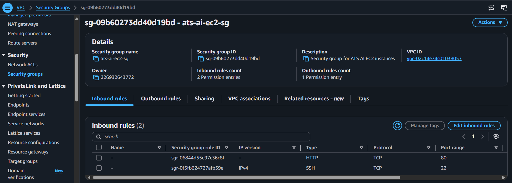
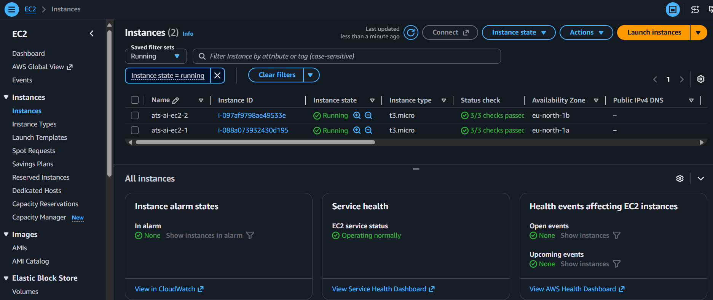
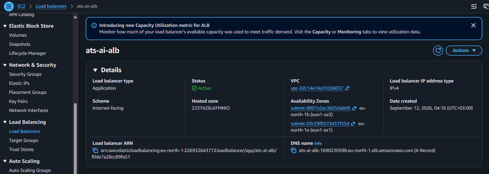
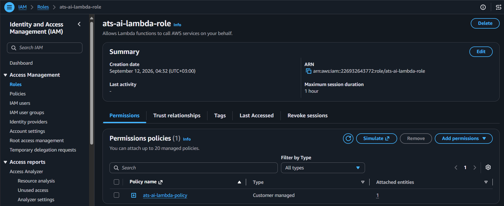
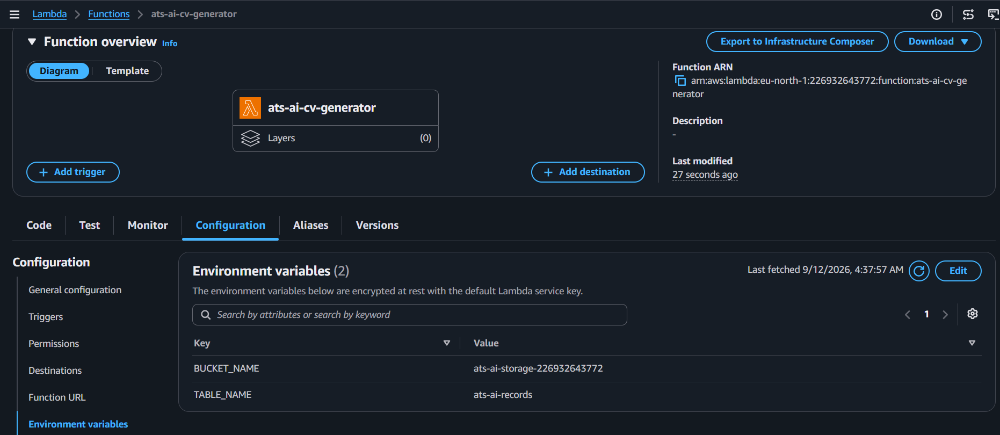
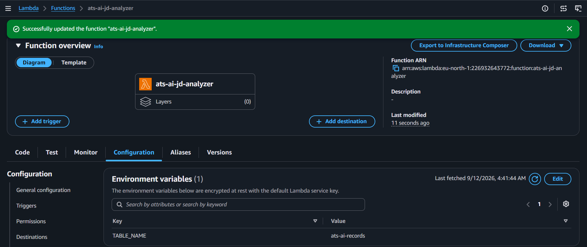
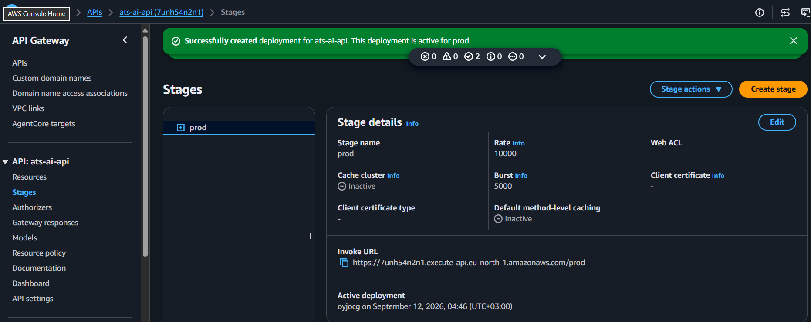
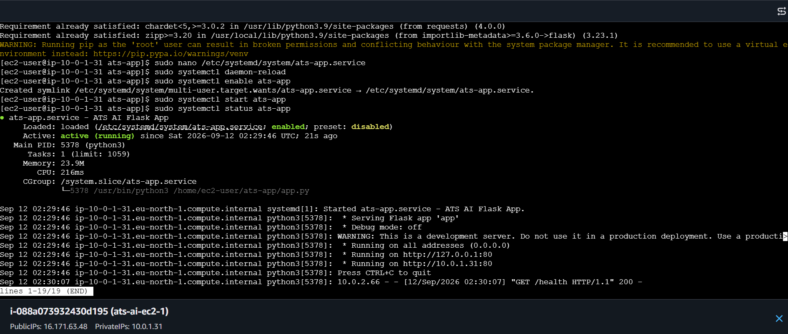

<a id="top"></a>

# 🛠️ Build Log — ATS CV Generator (AI-Enhanced)

Same build as the original ATS project, with Amazon Comprehend added at Steps 12–13. Screenshots below are trimmed to states that prove something — a name or setting already shown in a table isn't repeated as an image.

## 📋 Quick Navigation

| Step | Section |
|---|---|
| 1–10 | [🏗️ Core Infrastructure](#step-core) |
| 11 | [🔐 IAM Role & Policy](#step-11) |
| 12 | [⚡ Lambda: CV Generator + Comprehend](#step-12) |
| 13 | [⚡ Lambda: JD Analyzer + Comprehend](#step-13) |
| 14 | [🔌 API Gateway](#step-14) |
| 15 | [🚀 Flask Deployment](#step-15) |
| 16 | [✅ End-to-End Test](#step-16) |

---

<a id="step-core"></a>
## Steps 1–10 — 🏗️ Core Infrastructure

Identical pattern to the original ATS CV Generator project — same resource types, renamed with an `ats-ai-` prefix, deployed in `eu-north-1` instead of `us-east-1`.

| # | Resource | Value |
|---|---|---|
| 1 | Key pair | `ats-ai-keypair` |
| 2 | VPC | `ats-ai-vpc` — `10.0.0.0/16` |
| 3 | Subnets | `ats-ai-public-subnet-1` (eu-north-1a), `ats-ai-public-subnet-2` (eu-north-1b) |
| 4 | Internet Gateway | `ats-ai-igw` |
| 5 | Route Table | `ats-ai-public-rt` — `0.0.0.0/0 → igw` |
| 6 | Security Groups | `ats-ai-alb-sg` (HTTP from internet), `ats-ai-ec2-sg` (HTTP from ALB SG only) |
| 7 | EC2 | 2x `t3.micro`, one per subnet |
| 8 | Target Group + ALB | `ats-ai-target-group`, `ats-ai-alb` |
| 9 | S3 | `ats-ai-storage-<account-id>` |
| 10 | DynamoDB | `ats-ai-records` — partition key `cv_id` |





> ⚠️ **Issue carried over from the original project:** `t2.micro` is not Free Tier–eligible on new AWS accounts (post-July 2025 Free Plan) — used `t3.micro`.

> ⚠️ **New issue — region-specific IP range:** EC2 Instance Connect's service IP range is different per region. The `us-east-1` range used in the original project (`18.206.107.24/29`) does not work here. The `eu-north-1` range is `13.48.4.200/30` — this must be allowed on the SSH rule in `ats-ai-ec2-sg` instead.

---

<a id="step-11"></a>
## Step 11 — 🔐 IAM Role & Policy

Adds Comprehend permissions to the same least-privilege pattern as the original project.

```json
{
    "Version": "2012-10-17",
    "Statement": [
        {
            "Effect": "Allow",
            "Action": ["logs:CreateLogGroup", "logs:CreateLogStream", "logs:PutLogEvents"],
            "Resource": "*"
        },
        {
            "Effect": "Allow",
            "Action": ["s3:PutObject", "s3:GetObject"],
            "Resource": "arn:aws:s3:::ats-ai-storage-*/*"
        },
        {
            "Effect": "Allow",
            "Action": ["dynamodb:PutItem", "dynamodb:GetItem", "dynamodb:UpdateItem"],
            "Resource": "arn:aws:dynamodb:*:*:table/ats-ai-records"
        },
        {
            "Effect": "Allow",
            "Action": ["comprehend:DetectSentiment", "comprehend:DetectKeyPhrases"],
            "Resource": "*"
        }
    ]
}
```

> ⚠️ **Note:** Comprehend doesn't support resource-level ARN scoping the way S3 and DynamoDB do — the wildcard `Resource: "*"` here is a limitation of the service, not a looser policy choice.



---

<a id="step-12"></a>
## Step 12 — ⚡ Lambda: CV Generator + Comprehend

Builds the CV and saves it to S3, same as before — now also runs the professional summary through `DetectSentiment` and stores the result alongside the CV record.

| Setting | Value |
|---|---|
| Name | `ats-ai-cv-generator` |
| Runtime | Python 3.12 |
| Env vars | `BUCKET_NAME`, `TABLE_NAME` |
| Timeout / Memory | 30s / 256MB |

Full code: [`code/lambda_generator/lambda_function.py`](code/lambda_generator/lambda_function.py)



---

<a id="step-13"></a>
## Step 13 — ⚡ Lambda: JD Analyzer + Comprehend

Replaces the original regex keyword extraction with `DetectKeyPhrases` on both the CV text and the job description, then compares the resulting phrase sets instead of individual words.

| Setting | Value |
|---|---|
| Name | `ats-ai-jd-analyzer` |
| Runtime | Python 3.12 |
| Env vars | `TABLE_NAME` |
| Timeout | 30s (Comprehend calls need more time than the old regex logic) |

Full code: [`code/lambda_analyzer/lambda_function.py`](code/lambda_analyzer/lambda_function.py)



---

<a id="step-14"></a>
## Step 14 — 🔌 API Gateway

Same two-endpoint structure as the original project.

| Setting | Value |
|---|---|
| API name | `ats-ai-api` (REST, Regional) |
| Resources | `/generate` → `ats-ai-cv-generator`, `/analyze` → `ats-ai-jd-analyzer` |
| Stage | `prod` |



---

<a id="step-15"></a>
## Step 15 — 🚀 Flask Deployment

Same Flask app and systemd setup as the original project, deployed to both EC2 instances via EC2 Instance Connect.



---

<a id="step-16"></a>
## Step 16 — ✅ End-to-End Test

1. Opened the ALB DNS name and generated a CV — the response now includes a `tone_check` field from Comprehend sentiment analysis alongside the download link.
2. Ran the JD analyzer with a real job description — key phrases matched as coherent multi-word concepts instead of fragmented single words.

| Check | Result |
|---|---|
| CV generation + sentiment tone check | ✅ |
| JD analysis via key phrases | ✅ |
| Target group health | ✅ Healthy |


**🧹 Cleanup:** terminated both EC2 instances, deleted the ALB and target group immediately after testing. Lambda, S3, DynamoDB, API Gateway left running (near-zero idle cost).

---

<div align="center">

**[⬆ Back to top](#top)**

</div>
